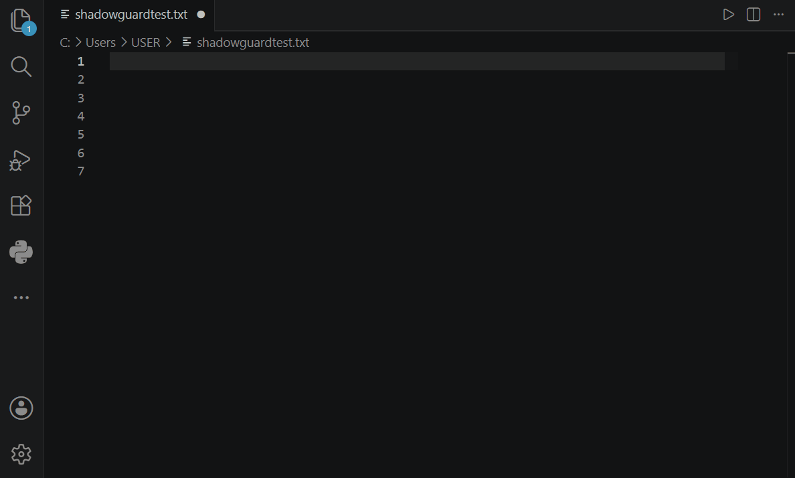

  

    

  
  
  

   

  <b>An elite, 100% air-gapped DevSecOps extension that detects leaked API keys, credentials, and custom database passwords in real-time as you type.</b>

 

Unlike standard regex-based scanners that only look for known vendor prefixes (like AWS or Stripe), ShadowGuard is powered by a locally executing, multi-threaded Go engine that calculates **Shannon Entropy**. If you type a highly random, custom 32-character password, ShadowGuard's mathematical engine will instantly flag it.

## The Architecture
* **Zero Latency:** The engine is written in Go, utilizing concurrent buffers to scan files in microseconds without blocking the Node.js event loop.
* **100% Air-Gapped:** No cloud telemetry. No user accounts. No API keys required. Your code never leaves your local machine.
* **Cryptographic Detection:** Uses Shannon Entropy algorithms ($H = - \sum p_i \log_2(p_i)$) to detect unknown, custom secrets that bypass standard linters.

## Features
* Scans all standard text and code documents locally.
* Highlights vulnerabilities instantly with red diagnostic squiggles.
* Supports Windows, macOS (Intel & Apple Silicon), and Linux via bundled cross-compiled binaries.

## Usage
Simply install the extension and write code. ShadowGuard runs silently in the background and will only alert you when a critical entropy threshold is breached.

---
*Engineered for secure backend architecture.*
